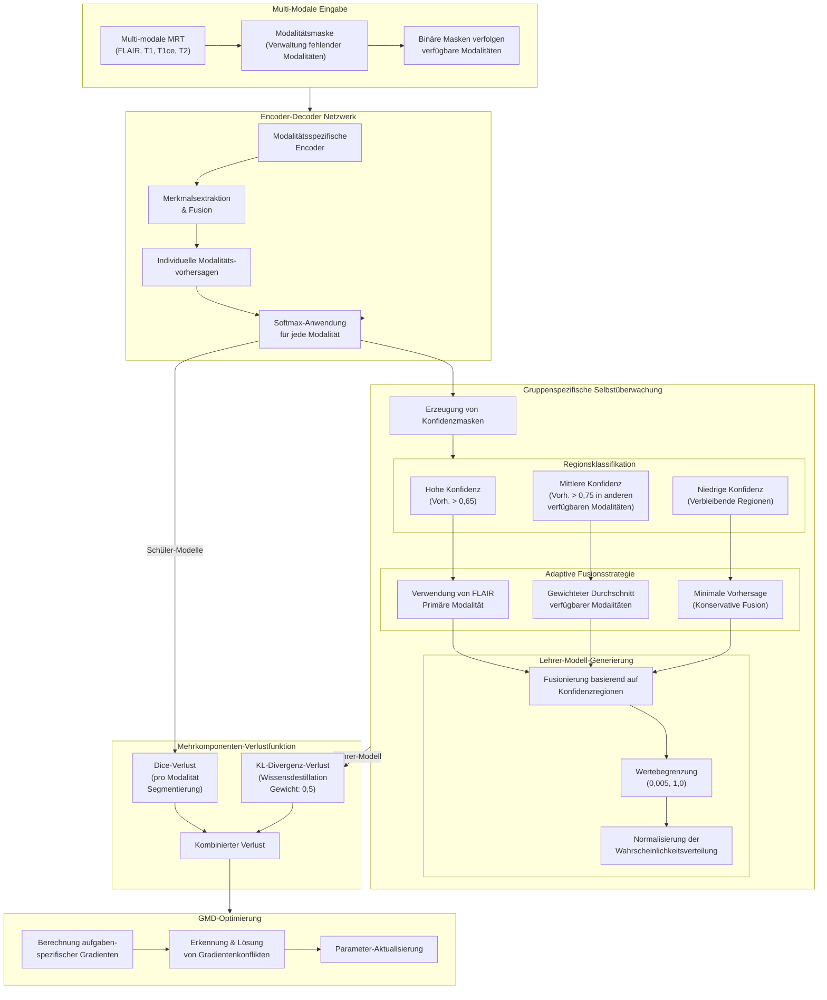

### Schlüsselkomponenten

| Komponente | Implementierungsdetails |
|------------|-------------------------|
| **Datenvorbereitung** | - Binäre Masken verfolgen verfügbare Modalitäten<br>- Verarbeitet beliebige Kombinationen fehlender Modalitäten<br>- Unterstützt unausgewogene Datensätze mit unterschiedlicher Verfügbarkeit |
| **Multi-Branch-Netzwerk** | - Modalitätsspezifische Encoder-Zweige<br>- Gemeinsame Cross-Attention-Fusionsmodule<br>- Spezialisierte Decoder für jede Modalität |
| **Konfidenzbasierte Regionsklassifikation** | - **Regionen mit HOHER Konfidenz (>0,65)**: Bereiche, in denen die FLAIR-Modalität starke Vorhersagen hat<br>- **Regionen mit MITTLERER Konfidenz (>0,75)**: Bereiche, in denen andere verfügbare Modalitäten stärkere Vorhersagen haben<br>- **Regionen mit NIEDRIGER Konfidenz**: Bereiche mit Unsicherheit über alle Modalitäten hinweg |
| **Adaptive Fusionsstrategie** | - HOHE Konfidenz: Verwendung der primären Modalität (FLAIR)<br>- MITTLERE Konfidenz: Gewichteter Durchschnitt verfügbarer Modalitäten<br>- NIEDRIGE Konfidenz: Minimale Vorhersage (konservativster Ansatz) |
| **Wissensdestillations-Pipeline** | - Lehrer-Modell durch optimale Fusion kombinierter Regionen erstellt<br>- Begrenzung und Normalisierung gewährleisten gültige Wahrscheinlichkeitsverteilung<br>- Schülermodelle lernen vom Lehrer durch KL-Divergenz-Verlust |
| **Verlustkomponenten** | - Dice-Verlust für direkte Segmentierungsüberwachung<br>- KL-Divergenz-Verlust für Wissensdestillation (Gewicht: 0,5)<br>- Kombinierte Optimierung durch GMD (Lösung von Gradientenkonflikten) |

## Gradient-Manipulation für Deep Learning (GMD)

Zur Optimierung unseres Multi-Task-Lernansatzes verwenden wir GMD, eine Technik zur effektiven Handhabung von Gradientenkonflikten:

1. **Erkennung von Konflikten**: Identifiziert widersprüchliche Gradienten zwischen verschiedenen Aufgaben durch negative Skalarprodukte
2. **Projektionsbasierte Lösung**: Projiziert konfliktbehaftete Gradientenkomponenten, um destruktive Interferenz zu verhindern
3. **Spezifische Parameterbehandlung**: Unterschiedliche Handhabung von gemeinsam genutzten vs. aufgabenspezifischen Parametern

## Vorteile unseres Ansatzes

- **Robust bei fehlenden Daten:** Funktioniert effektiv mit jeder Kombination verfügbarer Modalitäten
- **Regionsadaptives Lernen:** Wendet unterschiedliche Fusionsstrategien basierend auf Konfidenzleveln in verschiedenen Regionen an
- **Modalitätsübergreifender Wissenstransfer:** Modalitätsspezifische Zweige profitieren von Informationen aus anderen Modalitäten
- **Konfliktfreie Optimierung:** GMD verhindert destruktive Gradienteninterferenz zwischen Aufgaben
- **Klinische Anwendbarkeit:** Arbeitet mit realistischen klinischen Szenarien, in denen Daten unvollständig sind
- **Leistungserhaltung:** Behält hohe Leistung auch bei erheblich fehlenden Daten bei

## Implementierungsdetails

Die Lehrer-Vorhersage wird durch ein dreistufiges Konfidenzsystem sorgfältig konstruiert:

```python
# Hohe Konfidenz: FLAIR-Vorhersage direkt verwenden
pred_mask_l = flair_pred > 0.65

# Mittlere Konfidenz: Gewichteten Durchschnitt verfügbarer Modalitäten verwenden
pred_mask_m = ((t1ce_pred > 0.75)*mask[0,1] + (t1_pred > 0.75)*mask[0,2] + 
               (t2_pred > 0.75)*mask[0,3]) == (mask[0,1]+mask[0,2]+mask[0,3])

# Niedrige Konfidenz: Minimale Vorhersagen verwenden (konservativster Ansatz)
pred_mask_s = (all_one - pred_mask_l - pred_mask_m) == all_one
teacher_pred = pred_mask_l*flair_pred + pred_mask_m*weighted_average + pred_mask_s*minimum_pred
```

