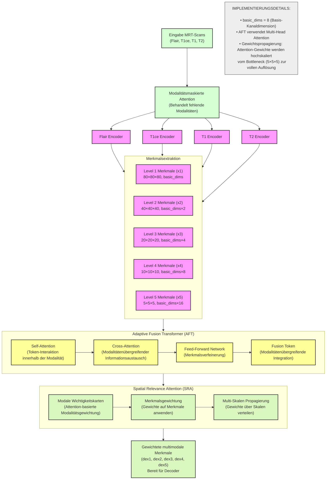

```mermaid
graph TD
    %% Style definitions
    classDef input fill:#d3ffd3,stroke:#333,stroke-width:2px,color:#333;
    classDef encoder fill:#f9f,stroke:#333,stroke-width:2px,color:#333;
    classDef transformer fill:#ff9,stroke:#333,stroke-width:2px,color:#333;
    classDef attention fill:#d9f7be,stroke:#333,stroke-width:2px,color:#333;
    
    %% PART A: INPUT, ENCODER, AND BOTTLENECK PROCESSING
    
    %% Input Section
    INPUT["Eingabe MRT-Scans<br/>(Flair, T1ce, T1, T2)"]:::input
    MMA["Modalitätsmaskierte Attention<br/>(Behandelt fehlende Modalitäten)"]:::input
    
    %% Encoder Branches for each modality
    FLAIR_ENC["Flair Encoder"]:::encoder
    T1CE_ENC["T1ce Encoder"]:::encoder
    T1_ENC["T1 Encoder"]:::encoder
    T2_ENC["T2 Encoder"]:::encoder
    
    %% Multi-scale Features (explicit levels for clarity)
    subgraph MULTI_SCALE_FEATURES["Merkmalsextraktion"]
        X1["Level 1 Merkmale (x1)<br/>80×80×80, basic_dims"]:::encoder
        X2["Level 2 Merkmale (x2)<br/>40×40×40, basic_dims×2"]:::encoder
        X3["Level 3 Merkmale (x3)<br/>20×20×20, basic_dims×4"]:::encoder
        X4["Level 4 Merkmale (x4)<br/>10×10×10, basic_dims×8"]:::encoder
        X5["Level 5 Merkmale (x5)<br/>5×5×5, basic_dims×16"]:::encoder
    end
    
    %% Adaptive Fusion Transformer
    subgraph AFT["Adaptive Fusion Transformer (AFT)"]
        SELF_ATTN["Self-Attention<br/>(Token-Interaktion innerhalb der Modalität)"]:::transformer
        CROSS_ATTN["Cross-Attention<br/>(Modalitätenübergreifender Informationsaustausch)"]:::transformer
        FFN["Feed-Forward Network<br/>(Merkmalsverfeinerung)"]:::transformer
        FUSION_TOKEN["Fusion Token<br/>(Modalitätenübergreifende Integration)"]:::transformer
    end
    
    %% Spatial Relevance Attention
    subgraph SRA["Spatial Relevance Attention (SRA)"]
        MODAL_WEIGHTS["Modale Wichtigkeitskarten<br/>(Attention-basierte Modalitätsgewichtung)"]:::attention
        FEATURE_WEIGHTING["Merkmalsgewichtung<br/>(Gewichte auf Merkmale anwenden)"]:::attention
        WEIGHT_PROP["Multi-Skalen Propagierung<br/>(Gewichte über Skalen verteilen)"]:::attention
    end
    
    %% Output from Encoder-AFT Section
    WEIGHTED_FEATURES["Gewichtete multimodale Merkmale<br/>(dex1, dex2, dex3, dex4, dex5)<br/>Bereit für Decoder"]:::attention
    
    %% Connections
    INPUT --> MMA
    MMA --> FLAIR_ENC
    MMA --> T1CE_ENC
    MMA --> T1_ENC
    MMA --> T2_ENC
    
    FLAIR_ENC --> MULTI_SCALE_FEATURES
    T1CE_ENC --> MULTI_SCALE_FEATURES
    T1_ENC --> MULTI_SCALE_FEATURES
    T2_ENC --> MULTI_SCALE_FEATURES
    
    MULTI_SCALE_FEATURES --> AFT
    
    SELF_ATTN --> CROSS_ATTN
    CROSS_ATTN --> FFN
    FFN --> FUSION_TOKEN
    
    AFT --> SRA
    MODAL_WEIGHTS --> FEATURE_WEIGHTING
    FEATURE_WEIGHTING --> WEIGHT_PROP
    
    SRA --> WEIGHTED_FEATURES
    
    %% Technical Details
    TECH_DETAILS["IMPLEMENTIERUNGSDETAILS:<br/><br/>• basic_dims = 8 (Basis-Kanaldimension)<br/>• AFT verwendet Multi-Head Attention<br/>• Gewichtspropagierung: Attention-Gewichte werden hochskaliert<br/>  vom Bottleneck (5×5×5) zur vollen Auflösung"]
    style TECH_DETAILS fill:#eee,stroke:#333,stroke-width:1px,color:#333
```
