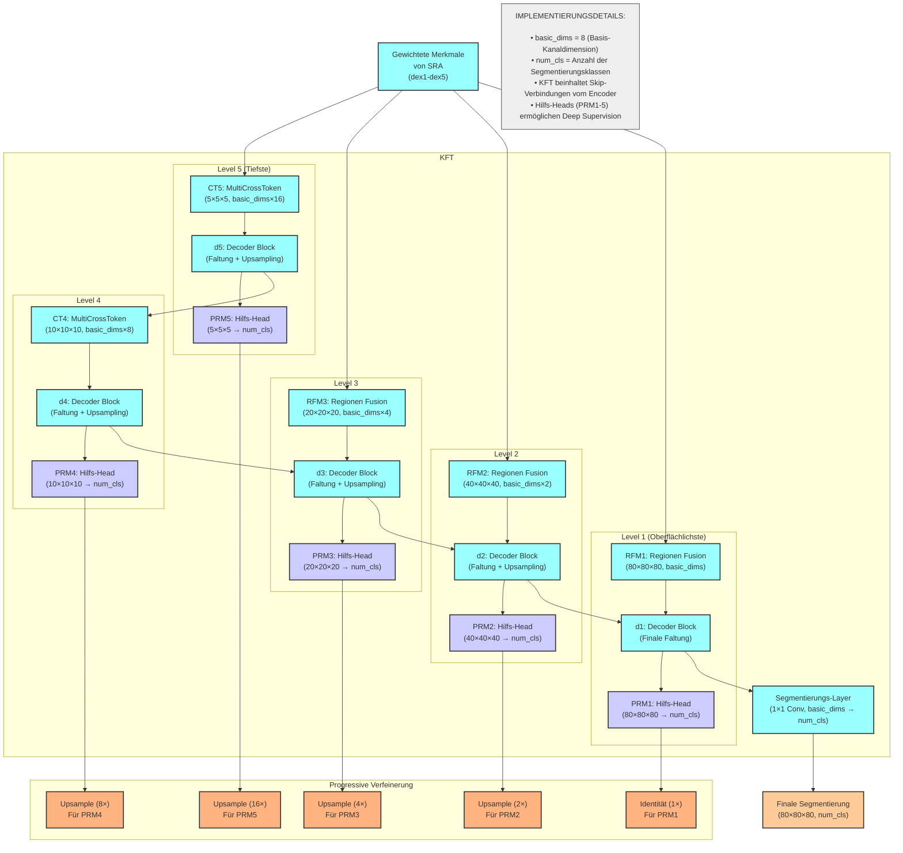

```mermaid
graph TD
    %% Style definitions
    classDef decoder fill:#9ff,stroke:#333,stroke-width:2px,color:#333;
    classDef auxHead fill:#ccf,stroke:#333,stroke-width:2px,color:#333;
    classDef regulation fill:#ffb380,stroke:#333,stroke-width:2px,color:#333;
    classDef output fill:#ffcc99,stroke:#333,stroke-width:2px,color:#333;
    
    %% PART B: KANLBEZOGENER FUSION TRANSFORMER ARCHITECTURE
    
    %% Decoder Input from Bottleneck
    INPUT_FEATURES["Gewichtete Merkmale<br/>von SRA<br/>(dex1-dex5)"]:::decoder
    
    %% KFT Architecture Simplified
    subgraph KFT
        %% Multi-scale structure with explicit levels
        subgraph LEVEL5["Level 5 (Tiefste)"]
            CT5["CT5: MultiCrossToken<br/>(5×5×5, basic_dims×16)"]:::decoder
            D5["d5: Decoder Block<br/>(Faltung + Upsampling)"]:::decoder
            PRM5["PRM5: Hilfs-Head<br/>(5×5×5 → num_cls)"]:::auxHead
        end
        
        subgraph LEVEL4["Level 4"]
            CT4["CT4: MultiCrossToken<br/>(10×10×10, basic_dims×8)"]:::decoder
            D4["d4: Decoder Block<br/>(Faltung + Upsampling)"]:::decoder
            PRM4["PRM4: Hilfs-Head<br/>(10×10×10 → num_cls)"]:::auxHead
        end
        
        subgraph LEVEL3["Level 3"]
            RFM3["RFM3: Regionen Fusion<br/>(20×20×20, basic_dims×4)"]:::decoder
            D3["d3: Decoder Block<br/>(Faltung + Upsampling)"]:::decoder
            PRM3["PRM3: Hilfs-Head<br/>(20×20×20 → num_cls)"]:::auxHead
        end
        
        subgraph LEVEL2["Level 2"]
            RFM2["RFM2: Regionen Fusion<br/>(40×40×40, basic_dims×2)"]:::decoder
            D2["d2: Decoder Block<br/>(Faltung + Upsampling)"]:::decoder
            PRM2["PRM2: Hilfs-Head<br/>(40×40×40 → num_cls)"]:::auxHead
        end
        
        subgraph LEVEL1["Level 1 (Oberflächlichste)"]
            RFM1["RFM1: Regionen Fusion<br/>(80×80×80, basic_dims)"]:::decoder
            D1["d1: Decoder Block<br/>(Finale Faltung)"]:::decoder
            PRM1["PRM1: Hilfs-Head<br/>(80×80×80 → num_cls)"]:::auxHead
        end
        
        %% Final Segmentation Layer
        SEG_LAYER["Segmentierungs-Layer<br/>(1×1 Conv, basic_dims → num_cls)"]:::decoder
    end
    
    %% Upsampling for Regulation
    subgraph REGULATION["Progressive Verfeinerung"]
        UP1["Identität (1×)<br/>Für PRM1"]:::regulation
        UP2["Upsample (2×)<br/>Für PRM2"]:::regulation
        UP4["Upsample (4×)<br/>Für PRM3"]:::regulation
        UP8["Upsample (8×)<br/>Für PRM4"]:::regulation
        UP16["Upsample (16×)<br/>Für PRM5"]:::regulation
    end
    
    %% Final Output
    FINAL_OUT["Finale Segmentierung<br/>(80×80×80, num_cls)"]:::output
    
    %% Connect Components
    INPUT_FEATURES --> CT5
    
    %% Level 5 connections
    CT5 --> D5
    D5 --> PRM5
    D5 --> CT4
    
    %% Level 4 connections
    CT4 --> D4
    D4 --> PRM4
    D4 --> D3
    
    %% Level 3 connections
    INPUT_FEATURES --> RFM3
    RFM3 --> D3
    D3 --> PRM3
    D3 --> D2
    
    %% Level 2 connections
    INPUT_FEATURES --> RFM2
    RFM2 --> D2
    D2 --> PRM2
    D2 --> D1
    
    %% Level 1 connections
    INPUT_FEATURES --> RFM1
    RFM1 --> D1
    D1 --> PRM1
    D1 --> SEG_LAYER
    
    %% Segmentation to output
    SEG_LAYER --> FINAL_OUT
    
    %% PRM to regulation
    PRM1 --> UP1
    PRM2 --> UP2
    PRM3 --> UP4
    PRM4 --> UP8
    PRM5 --> UP16
    
    %% Technical Details
    TECH_DETAILS["IMPLEMENTIERUNGSDETAILS:<br/><br/>• basic_dims = 8 (Basis-Kanaldimension)<br/>• num_cls = Anzahl der Segmentierungsklassen<br/>• KFT beinhaltet Skip-Verbindungen vom Encoder<br/>• Hilfs-Heads (PRM1-5) ermöglichen Deep Supervision"]
    style TECH_DETAILS fill:#eee,stroke:#333,stroke-width:1px,color:#333
```
