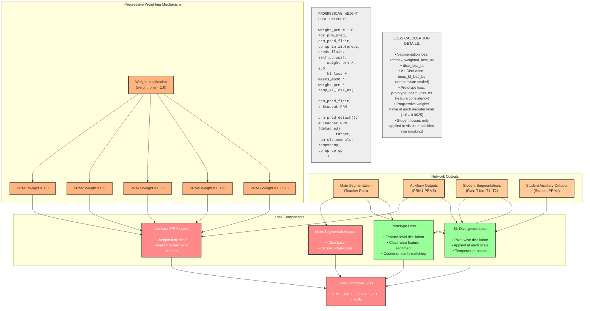

```mermaid
graph TD
    %% Style definitions
    classDef losses fill:#f88,stroke:#333,stroke-width:2px,color:#fff;
    classDef regulation fill:#ffb380,stroke:#333,stroke-width:2px,color:#333;
    classDef prism fill:#9f9,stroke:#333,stroke-width:2px,color:#333;
    classDef outputs fill:#ffcc99,stroke:#333,stroke-width:2px,color:#333;
    
    %% PART D: LOSS COMPUTATION
    
    %% Model Outputs
    subgraph OUTPUTS["Network Outputs"]
        MAIN_SEG["Main Segmentation<br/>(Teacher Path)"]:::outputs
        AUX_SEG["Auxiliary Outputs<br/>(PRM1-PRM5)"]:::outputs
        STUDENT_SEG["Student Segmentations<br/>(Flair, T1ce, T1, T2)"]:::outputs
        STUDENT_AUX["Student Auxiliary Outputs<br/>(Student PRMs)"]:::outputs
    end
    
    %% Progressive Weighting
    subgraph WEIGHTING["Progressive Weighting Mechanism"]
        WEIGHTS["Weight Initialization<br/>(weight_prm = 1.0)"]:::regulation
        
        WEIGHT1["PRM1 Weight = 1.0"]:::regulation
        WEIGHT2["PRM2 Weight = 0.5"]:::regulation
        WEIGHT3["PRM3 Weight = 0.25"]:::regulation
        WEIGHT4["PRM4 Weight = 0.125"]:::regulation
        WEIGHT5["PRM5 Weight = 0.0625"]:::regulation
    end
    
    %% Loss Components 
    subgraph LOSS_COMPONENTS["Loss Components"]
        %% Main Segmentation Loss
        MAIN_LOSS["Main Segmentation Loss<br/><br/>• Dice Loss<br/>• Cross-Entropy Loss"]:::losses
        
        %% Auxiliary (PRM) Loss
        AUX_LOSS["Auxiliary (PRM) Loss<br/><br/>• Weighted by scale<br/>• Applied to teacher & students"]:::losses
        
        %% PRISM-specific Losses
        KL_LOSS["KL Divergence Loss<br/><br/>• Pixel-wise distillation<br/>• Applied at each scale<br/>• Temperature-scaled"]:::prism
        
        PROTO_LOSS["Prototype Loss<br/><br/>• Feature-level distillation<br/>• Class-wise feature alignment<br/>• Cosine similarity matching"]:::prism
    end
    
    %% Combined Loss
    FINAL_LOSS["Final Combined Loss<br/><br/>L = L_seg + L_aux + L_kl + L_proto"]:::losses
    
    %% Code Example
    CODE_EXAMPLE["PROGRESSIVE WEIGHT CODE SNIPPET:<br/><br/>weight_prm = 1.0<br/>for prm_pred, prm_pred_flair, up_op in zip(preds, preds_flair, self.up_ops):<br/>    weight_prm /= 2.0<br/>    kl_loss += masks_mod0 * weight_prm * temp_kl_loss_bs(<br/>        prm_pred_flair,    # Student PRM<br/>        prm_pred.detach(), # Teacher PRM (detached)<br/>        target, num_cls=num_cls, temp=temp, up_op=up_op<br/>    )"]
    style CODE_EXAMPLE fill:#eee,stroke:#333,stroke-width:1px,color:#333,text-align:left,font-family:monospace
    
    %% Connect Components
    MAIN_SEG --> MAIN_LOSS
    AUX_SEG --> AUX_LOSS
    
    WEIGHTS --> WEIGHT1
    WEIGHTS --> WEIGHT2
    WEIGHTS --> WEIGHT3
    WEIGHTS --> WEIGHT4
    WEIGHTS --> WEIGHT5
    
    WEIGHT1 --> AUX_LOSS
    WEIGHT2 --> AUX_LOSS
    WEIGHT3 --> AUX_LOSS
    WEIGHT4 --> AUX_LOSS
    WEIGHT5 --> AUX_LOSS
    
    STUDENT_SEG --> KL_LOSS
    MAIN_SEG --> KL_LOSS
    
    STUDENT_AUX --> KL_LOSS
    AUX_SEG --> KL_LOSS
    
    STUDENT_SEG --> PROTO_LOSS
    MAIN_SEG --> PROTO_LOSS
    
    MAIN_LOSS --> FINAL_LOSS
    AUX_LOSS --> FINAL_LOSS
    KL_LOSS --> FINAL_LOSS
    PROTO_LOSS --> FINAL_LOSS
    
    %% Technical Details
    TECH_DETAILS["LOSS CALCULATION DETAILS:<br/><br/>• Segmentation loss: softmax_weighted_loss_bs + dice_loss_bs<br/>• KL Distillation: temp_kl_loss_bs (temperature-scaled)<br/>• Prototype loss: prototype_prism_loss_bs (feature consistency)<br/>• Progressive weights halve at each decoder level (1.0→0.0625)<br/>• Student losses only applied to visible modalities (via masking)"]
    style TECH_DETAILS fill:#eee,stroke:#333,stroke-width:1px,color:#333
```
