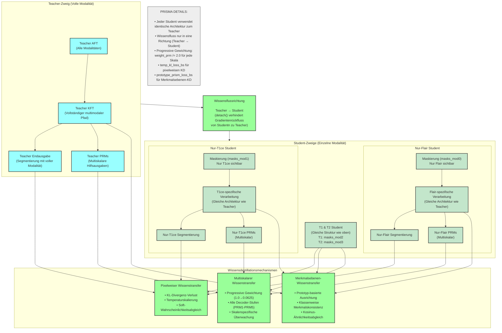

```mermaid
graph TD
    %% Stildefinitionen
    classDef student fill:#c3e6cb,stroke:#333,stroke-width:2px,color:#333;
    classDef prism fill:#9f9,stroke:#333,stroke-width:2px,color:#333;
    classDef teacher fill:#9ff,stroke:#333,stroke-width:2px,color:#333;
    classDef output fill:#ffcc99,stroke:#333,stroke-width:2px,color:#333;
    
    %% TEIL C: PRISMA SELBST-DESTILLATIONSMECHANISMUS
    
    %% Teacher-Zweig (Hauptpfad mit voller Modalität)
    subgraph TEACHER["Teacher-Zweig (Volle Modalität)"]
        TEACH_BOTTLE["Teacher AFT<br/>(Alle Modalitäten)"]:::teacher
        TEACH_DEC["Teacher KFT<br/>(Vollständiger multimodaler Pfad)"]:::teacher
        TEACH_OUT["Teacher Endausgabe<br/>(Segmentierung mit voller Modalität)"]:::teacher
        TEACH_PRM["Teacher PRMs<br/>(Multiskalare Hilfsausgaben)"]:::teacher
        
        TEACH_BOTTLE --> TEACH_DEC
        TEACH_DEC --> TEACH_OUT
        TEACH_DEC --> TEACH_PRM
    end
    
    %% Student-Zweige (Modalspezifische Pfade)
    subgraph STUDENTS["Student-Zweige (Einzelne Modalität)"]
        %% Nur-Flair Student
        subgraph FLAIR_STUDENT["Nur-Flair Student"]
            FLAIR_MASK["Maskierung (masks_mod0)<br/>Nur Flair sichtbar"]:::student
            FLAIR_PROC["Flair-spezifische Verarbeitung<br/>(Gleiche Architektur wie Teacher)"]:::student
            FLAIR_OUT["Nur-Flair Segmentierung"]:::student
            FLAIR_PRM["Nur-Flair PRMs<br/>(Multiskalar)"]:::student
            
            FLAIR_MASK --> FLAIR_PROC
            FLAIR_PROC --> FLAIR_OUT
            FLAIR_PROC --> FLAIR_PRM
        end
        
        %% Nur-T1ce Student
        subgraph T1CE_STUDENT["Nur-T1ce Student"]
            T1CE_MASK["Maskierung (masks_mod1)<br/>Nur T1ce sichtbar"]:::student
            T1CE_PROC["T1ce-spezifische Verarbeitung<br/>(Gleiche Architektur wie Teacher)"]:::student
            T1CE_OUT["Nur-T1ce Segmentierung"]:::student
            T1CE_PRM["Nur-T1ce PRMs<br/>(Multiskalar)"]:::student
            
            T1CE_MASK --> T1CE_PROC
            T1CE_PROC --> T1CE_OUT
            T1CE_PROC --> T1CE_PRM
        end
        
        %% T1 und T2 Student (vereinfachte Darstellung)
        T1_T2_STUDENTS["T1 & T2 Student<br/>(Gleiche Struktur wie oben)<br/>T1: masks_mod2<br/>T2: masks_mod3"]:::student
    end
    
    %% Wissensdestillationsmechanismen
    subgraph KD_MECHANISMS["Wissensdestillationsmechanismen"]
        PIXEL_KD["Pixelweiser Wissenstransfer<br/><br/>• KL-Divergenz-Verlust<br/>• Temperaturskalierung<br/>• Soft-Wahrscheinlichkeitsabgleich"]:::prism
        
        FEATURE_KD["Merkmalsebenen-Wissenstransfer<br/><br/>• Prototyp-basierte Ausrichtung<br/>• Klassenweise Merkmalskonsistenz<br/>• Kosinus-Ähnlichkeitsabgleich"]:::prism
        
        MULTISCALE_KD["Multiskalarer Wissenstransfer<br/><br/>• Progressive Gewichtung (1.0→0.0625)<br/>• Alle Decoder-Stufen (PRM1-PRM5)<br/>• Skalenspezifische Überwachung"]:::prism
    end
    
    %% Wissensfluss
    KD_FLOW["Wissensflussrichtung<br/><br/>Teacher → Student<br/>(detach() verhindert Gradientenrückfluss<br/>von Studentn zu Teacher)"]:::prism
    
    %% Komponenten verbinden
    TEACH_OUT --> PIXEL_KD
    FLAIR_OUT --> PIXEL_KD
    T1CE_OUT --> PIXEL_KD
    T1_T2_STUDENTS --> PIXEL_KD
    
    TEACH_DEC --> FEATURE_KD
    FLAIR_PROC --> FEATURE_KD
    T1CE_PROC --> FEATURE_KD
    T1_T2_STUDENTS --> FEATURE_KD
    
    TEACH_PRM --> MULTISCALE_KD
    FLAIR_PRM --> MULTISCALE_KD
    T1CE_PRM --> MULTISCALE_KD
    T1_T2_STUDENTS --> MULTISCALE_KD
    
    TEACHER --> KD_FLOW
    KD_FLOW --> STUDENTS
    
    %% Technische Details
    TECH_DETAILS["PRISMA DETAILS:<br/><br/>• Jeder Student verwendet identische Architektur zum Teacher<br/>• Wissensfluss nur in eine Richtung (Teacher → Student)<br/>• Progressive Gewichtung: weight_prm /= 2.0 für jede Skala<br/>• temp_kl_loss_bs für pixelweisen KD<br/>• prototype_prism_loss_bs für Merkmalsebenen-KD"]
    style TECH_DETAILS fill:#eee,stroke:#333,stroke-width:1px,color:#333
```
